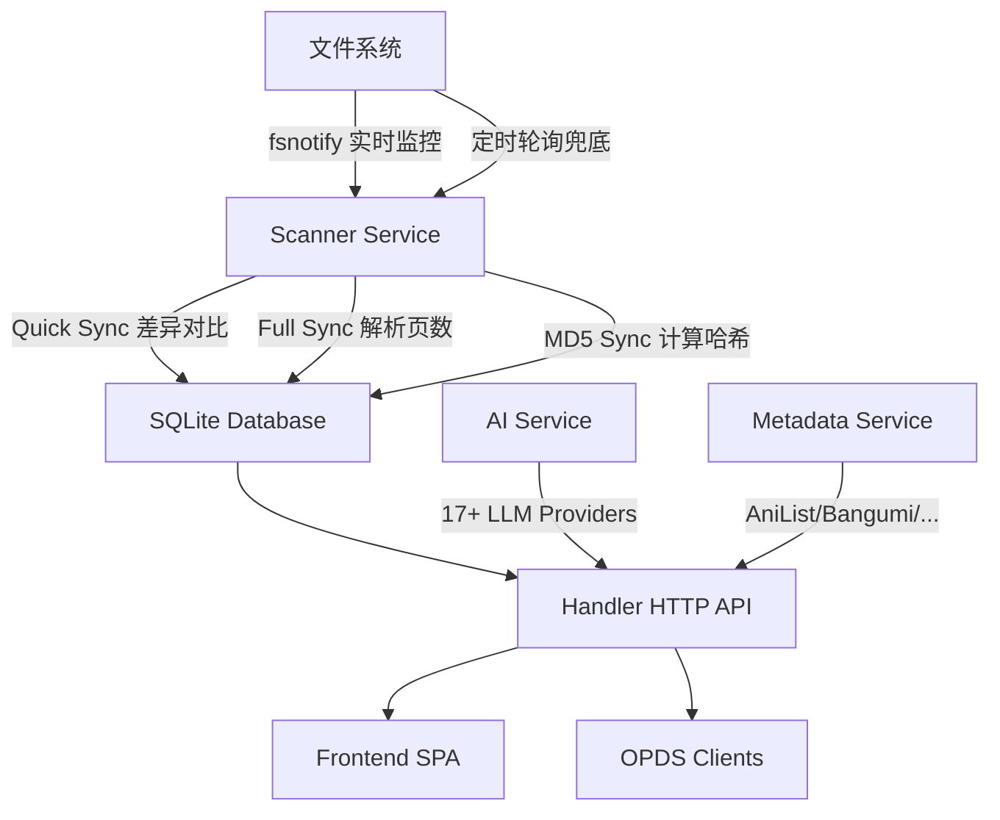

# NowenReader

<p align="center">
  <strong>高性能自托管漫画 & 小说管理平台</strong><br>
  Go 构建 — 单二进制、轻量、易部署
</p>

<p align="center">
  <a href="#-快速开始">快速开始</a> •
  <a href="#-特性">特性</a> •
  <a href="#-架构概览">架构</a> •
  <a href="#-api-端点">API</a> •
  <a href="#️-开发">开发</a> •
  <a href="#-常见问题">FAQ</a>
</p>

---

## ✨ 特性

### 📚 内容管理
- 📖 **多格式支持** — 漫画：ZIP/CBZ/CBR/RAR/7Z/CB7/PDF；小说：TXT/EPUB/MOBI/AZW3/HTML
- 🔄 **自动扫描** — fsnotify 文件系统实时监控 + 定时轮询双保障，自动发现新增/删除文件
- 🏷️ **标签 & 分类** — 多标签、多分类管理，标签颜色自定义
- 📁 **合并分组** — 自定义合并分组（如系列卷册归组），支持自动检测 & 批量创建
- ⭐ **收藏 & 评分** — 一键收藏、1-5 星评分
- 📋 **阅读状态** — 未读 / 在读 / 已读 / 搁置，配合「继续阅读」快速恢复
- ✏️ **元数据编辑** — 在线编辑标题、作者、出版社、年份、描述等元数据字段
- 📤 **文件上传** — 支持 ZIP/CBZ/CBR/RAR/7Z/PDF 直接上传
- 🔄 **批量操作** — 批量打标签、分类、删除、翻译、获取元数据
- 🧹 **无效清理** — 一键清理文件已不存在的失效条目
- 🔍 **重复检测** — 多维度重复检测（文件哈希、大小、标题相似度），支持一键去重

### 🔍 元数据 & 智能
- 🌐 **元数据抓取** — AniList / Bangumi / MangaDex / MangaUpdates / Kitsu
- 📋 **ComicInfo.xml 扫描** — 自动提取漫画内嵌元数据
- 📕 **小说元数据扫描** — 自动提取 EPUB/TXT 小说元数据
- 🤖 **AI 集成** — 17+ LLM 供应商，智能标签、语义搜索、封面相似度检测
- 🏷️ **标签翻译** — 中英文标签自动翻译（AI 驱动）
- 📝 **元数据翻译** — 批量翻译漫画标题、简介、类型
- 🎯 **个性化推荐** — 基于阅读历史 + 标签相似度 + AI 推荐理由

### 🤖 AI 功能矩阵
| 功能 | 说明 |
|------|------|
| 🔎 语义搜索 | 自然语言搜索漫画，如「关于巨人的漫画」 |
| 📝 智能摘要 | 生成漫画/小说内容摘要 |
| 🏷️ 标签建议 | 基于内容 AI 推荐标签（支持批量） |
| 📂 分类建议 | AI 推荐合适的分类（支持批量） |
| 🖼️ 封面分析 | 分析封面内容，辅助分类 |
| 📖 文件名解析 | 从文件名中智能提取元数据 |
| 📊 阅读洞察 | 基于阅读统计生成个性化阅读报告 |
| 💬 AI 对话 | 阅读器内置 AI 聊天，讨论当前阅读内容 |
| 📑 章节摘要 | 生成小说章节摘要（支持批量） |
| 📖 章节回顾 | 快速回顾之前章节的内容 |
| 🌐 页面翻译 | 漫画页面 OCR + 翻译 |
| 📋 完善元数据 | AI 补全缺失的元数据字段 |
| 🔗 分组检测 | AI 增强的系列/卷册自动分组检测 |
| ✅ 重复验证 | AI 验证重复检测结果的准确性 |
| 🎯 推荐理由 | AI 生成个性化推荐理由 |
| 📅 目标建议 | 基于阅读习惯推荐合理阅读目标 |
| 🔧 提示词模板 | 可自定义 AI 提示词模板 |
| 📊 用量统计 | AI 调用次数、Token 消耗、耗时统计 |

### 📖 阅读体验
- 📖 **漫画阅读器** — 单页 / 双页 / 条漫 / Webtoon 多种阅读模式
- 📕 **小说阅读器** — EPUB 章节渲染、TXT 智能分章阅读
- 📄 **PDF 阅读器** — 基于 PDF.js 的原生 PDF 渲染
- ▶️ **继续阅读** — 首页快速恢复上次阅读位置
- 📊 **阅读统计** — 阅读时间、会话记录、每日趋势、增强统计、年度报告
- 📁 **文件统计** — 各格式文件数量、存储空间占用分析
- 🎯 **阅读目标** — 设定每日/每周阅读目标，追踪达成进度
- 📤 **数据导出** — JSON 全量导出、CSV 会话/漫画导出
- ⚙️ **阅读器设置** — 适应模式（容器/宽度/高度）、阅读方向（LTR/RTL）、自动翻页、预加载、无限滚动

### 🔗 协议 & 集成
- 📡 **OPDS 协议** — 支持 KOReader / Moon+ Reader 等阅读器

### 🛠️ 部署 & 架构
- 🚀 **Go 单二进制** — 无需 Node.js / npm，前端编译进二进制，一个文件部署
- 🔐 **用户认证** — 多用户支持，管理员 / 普通用户角色，Cookie Session 认证
- 🖼️ **缩略图管理** — WebP 自动生成，批量管理，自定义尺寸
- 📂 **文件夹浏览** — Web 界面直接浏览并选择服务器目录
- 📋 **错误日志** — 管理员可查看、导出、清理系统错误日志
- 💾 **SQLite** — 零配置数据库，WAL 模式高性能，自动 Schema 迁移
- 🐳 **Docker** — 多平台镜像（amd64/arm64），~30MB 极小镜像
- 📱 **PWA** — 可安装为桌面 / 移动应用
- 🌐 **多语言** — i18n 国际化（中文 / English）
- 🎨 **主题** — 深色 / 浅色 / 跟随系统
- 📱 **响应式** — 桌面端 + 移动端自适应，底部导航栏
- ⚙️ **独立设置页** — 站点设置、AI 配置、文件统计、关于信息集中管理
- 🔒 **安全中间件** — CORS / Auth / Gzip / Rate Limit / Security Headers / Request Timeout

---

## 🏗️ 架构概览

```
┌─────────────────────────────────────────────────────────┐
│                  NowenReader Architecture                │
├──────────────────────┬──────────────────────────────────┤
│   Frontend (SPA)     │   Backend (Go)                   │
│                      │                                  │
│  React 19            │  Gin Web Framework               │
│  Vite 6              │  ┌─────────────────────────┐     │
│  Tailwind CSS v4     │  │ Handler (HTTP API)       │     │
│  React Router v7     │  ├─────────────────────────┤     │
│  lucide-react        │  │ Middleware               │     │
│  PDF.js              │  │ (CORS/Auth/Gzip/Rate     │     │
│                      │  │  Limit/Security/Timeout) │     │
│  ┌──────────────┐    │  ├─────────────────────────┤     │
│  │ Pages        │    │  │ Service                  │     │
│  │ Components   │    │  │ (AI/Scanner/Metadata/    │     │
│  │ Hooks        │    │  │  Recommend/OPDS/Tag)     │     │
│  │ i18n         │    │  ├─────────────────────────┤     │
│  │ Theme        │    │  │ Store (SQLite + FTS5)    │     │
│  │ Auth Context │    │  ├─────────────────────────┤     │
│  └──────────────┘    │  │ Archive                  │     │
│                      │  │ (ZIP/RAR/7Z/PDF/EPUB/TXT)│     │
│  go:embed ──────────►│  └─────────────────────────┘     │
│  编译进二进制         │                                  │
└──────────────────────┴──────────────────────────────────┘
                              │
                    ┌─────────┴─────────┐
                    │   SQLite (WAL)    │
                    │   FTS5 全文索引    │
                    └───────────────────┘
```

### 核心数据流



---

## 📁 项目结构

```
nowen-reader/
├── cmd/
│   ├── server/              # 主服务入口 (main.go) — 启动 HTTP/DB/Scanner
│   └── migrate/             # 数据库迁移 CLI (main.go) — Prisma → SQLite 迁移
├── internal/
│   ├── archive/             # 压缩包 & 电子书解析
│   │   ├── archive.go       # ZIP/RAR/7Z/PDF 页面提取
│   │   ├── epub_reader.go   # EPUB 解析 (章节/资源/元数据)
│   │   ├── txt_reader.go    # TXT 智能分章 (正则识别章节标题)
│   │   ├── html_reader.go   # HTML 小说解析
│   │   └── thumbnail.go     # 缩略图生成 (WebP, cwebp/mutool)
│   ├── config/              # 配置管理
│   │   ├── config.go        # SiteConfig JSON + 环境变量 + 文件格式定义
│   │   └── config_test.go   # 配置单元测试
│   ├── handler/             # HTTP API Handler (25 个文件)
│   │   ├── router.go        # 路由注册 (所有 API 路由集中管理)
│   │   ├── auth.go          # 认证 (注册/登录/登出/用户管理)
│   │   ├── comic.go         # 漫画 CRUD (列表/详情/收藏/评分/进度/状态/元数据编辑)
│   │   ├── images.go        # 图片服务 (页面/缩略图/EPUB资源/章节内容/PDF流)
│   │   ├── metadata.go      # 元数据抓取 (搜索/应用/扫描/批量/翻译)
│   │   ├── ai_handler.go    # AI 服务 (语义搜索/摘要/标签/封面/对话/翻译/分组等)
│   │   ├── group_handler.go # 合并分组 (创建/更新/删除/漫画归属/自动检测)
│   │   ├── recommendation_handler.go # 个性化推荐
│   │   ├── goal_handler.go  # 阅读目标 (设定/进度/删除)
│   │   ├── export_handler.go # 数据导出 (JSON/CSV)
│   │   ├── opds_handler.go  # OPDS 协议
│   │   ├── browse.go        # 文件夹浏览 (服务器目录选择)
│   │   ├── log_handler.go   # 错误日志 (查看/统计/导出/清理)
│   │   ├── thumbnails.go    # 缩略图管理 (批量生成/清理/统计)
│   │   ├── tag_translate_handler.go # 标签翻译
│   │   ├── stats.go         # 阅读统计 (基础/增强/年度/文件)
│   │   ├── settings.go      # 站点设置
│   │   ├── upload.go        # 文件上传
│   │   ├── cache.go         # 缓存管理
│   │   ├── tags.go          # 标签管理
│   │   ├── categories.go    # 分类管理
│   │   ├── spa.go           # SPA 路由 (嵌入前端/目录前端/API-only)
│   │   └── handler_test.go  # Handler 单元测试
│   ├── middleware/           # 中间件
│   │   ├── auth.go          # 认证中间件 (AuthRequired/AdminRequired)
│   │   ├── cors.go          # 跨域处理
│   │   ├── gzip.go          # Gzip 压缩
│   │   ├── logger.go        # 请求日志 (开发模式/静默模式)
│   │   ├── ratelimit.go     # 速率限制 (滑动窗口)
│   │   ├── security.go      # 安全头 (XSS/CSP/HSTS 等)
│   │   ├── timeout.go       # 请求超时控制
│   │   ├── error_log.go     # 错误日志捕获
│   │   ├── middleware_test.go # 中间件单元测试
│   │   └── ratelimit_test.go  # 限流单元测试
│   ├── model/               # 数据模型
│   │   └── models.go        # User/Comic/Tag/Category/ReadingSession/ComicGroup
│   ├── service/             # 业务逻辑层
│   │   ├── ai.go            # AI 服务 (17+ 供应商适配/提示词模板/用量统计)
│   │   ├── scanner.go       # 文件扫描器 (fsnotify + 轮询/Quick/Full/MD5 Sync)
│   │   ├── metadata.go      # 元数据抓取 (AniList/Bangumi/MangaDex/MangaUpdates/Kitsu)
│   │   ├── recommendation.go # 个性化推荐算法
│   │   ├── comic_parser.go  # 压缩包解析 (页数统计)
│   │   ├── opds.go          # OPDS Atom Feed 生成
│   │   ├── tag_translate.go # 标签翻译服务
│   │   └── session_cleanup.go # 过期阅读会话清理
│   └── store/               # 数据库层 (SQLite)
│       ├── db.go            # 数据库连接与初始化 (WAL/FTS5)
│       ├── migrate.go       # Schema 自动迁移 (版本化)
│       ├── comic_store.go   # 漫画 CRUD
│       ├── comic_query.go   # 复杂查询 (搜索/筛选/分页/排序/FTS5全文搜索)
│       ├── comic_batch.go   # 批量操作
│       ├── comic_stats.go   # 统计查询 (基础/增强/年度/文件)
│       ├── group_store.go   # 合并分组存储
│       ├── stats_store.go   # 阅读会话存储
│       ├── reading_goal.go  # 阅读目标存储
│       ├── user_store.go    # 用户存储
│       ├── db_test.go       # 数据库单元测试
│       └── migrate_test.go  # 迁移单元测试
├── web/
│   ├── embed.go             # go:embed 前端嵌入
│   └── dist/                # 前端构建产物 (编译时填充)
├── frontend/                # Vite + React 19 + TypeScript 前端
│   ├── vite.config.ts       # Vite 配置 (代理/别名/Next.js shims)
│   ├── package.json         # 依赖管理 (React 19 / Tailwind v4 / lucide-react / PDF.js)
│   └── src/
│       ├── main.tsx          # 应用入口 (路由/Provider/主题/i18n/认证)
│       ├── api/              # API 客户端 (comics/groups)
│       ├── app/              # 页面
│       │   ├── page.tsx              # 首页 (漫画列表/搜索/筛选/批量/分组)
│       │   ├── comic/[id]/page.tsx   # 漫画详情页
│       │   ├── novel/[id]/page.tsx   # 小说详情页
│       │   ├── reader/[id]/page.tsx  # 阅读器 (漫画/PDF)
│       │   ├── group/[id]/page.tsx   # 分组详情页
│       │   ├── settings/page.tsx     # 设置页 (站点/AI/文件统计/关于)
│       │   ├── stats/page.tsx        # 阅读统计页
│       │   ├── recommendations/page.tsx # 推荐页
│       │   └── logs/page.tsx         # 错误日志页 (管理员)
│       ├── components/       # UI 组件 (30+)
│       │   ├── reader/       # 阅读器组件
│       │   │   ├── SinglePageView.tsx      # 单页模式
│       │   │   ├── DoublePageView.tsx      # 双页模式
│       │   │   ├── WebtoonView.tsx         # 条漫/Webtoon 模式
│       │   │   ├── TextReaderView.tsx      # 小说文本阅读
│       │   │   ├── PdfView.tsx             # PDF 渲染 (PDF.js)
│       │   │   ├── AIChatPanel.tsx         # AI 对话面板
│       │   │   ├── PageTranslateOverlay.tsx # 页面翻译叠加层
│       │   │   ├── ReaderToolbar.tsx       # 阅读器工具栏
│       │   │   ├── NovelToolbar.tsx        # 小说工具栏
│       │   │   └── ReaderOptionsPanel.tsx  # 阅读器设置面板
│       │   ├── AISettingsPanel.tsx    # AI 设置面板
│       │   ├── SiteSettingsPanel.tsx  # 站点设置面板
│       │   ├── FileStatsPanel.tsx     # 文件统计面板
│       │   ├── DuplicateDetector.tsx  # 重复检测组件
│       │   ├── AutoDetectPanel.tsx    # 自动分组检测
│       │   ├── MetadataSearch.tsx     # 元数据搜索
│       │   ├── ComicCard.tsx          # 漫画卡片
│       │   ├── GroupCard.tsx          # 分组卡片
│       │   ├── BatchToolbar.tsx       # 批量操作工具栏
│       │   ├── TagFilter.tsx          # 标签筛选器
│       │   ├── CategoryFilter.tsx     # 分类筛选器
│       │   ├── ContinueReading.tsx    # 继续阅读组件
│       │   ├── Recommendations.tsx    # 推荐组件
│       │   ├── StatsPanel.tsx         # 统计面板
│       │   └── ...                    # 其他 (Navbar/Toast/AuthGuard 等)
│       ├── hooks/            # 自定义 Hooks (8 个)
│       ├── lib/              # 核心库
│       │   ├── i18n/         # 国际化 (zh-CN / English)
│       │   ├── theme-context.tsx  # 主题管理 (dark/light/system)
│       │   ├── auth-context.tsx   # 认证上下文
│       │   ├── apiClient.ts       # API 请求客户端
│       │   └── pwa.ts             # PWA Service Worker 注册
│       ├── shims/            # Next.js 兼容层 (迁移保留)
│       └── types/            # TypeScript 类型定义
├── .github/
│   └── workflows/
│       ├── build.yml         # CI: 测试 → 构建二进制 → Docker 推送 → GitHub Release
│       └── deploy.yml        # CD: 测试 → Docker 构建推送 → SSH 自动部署
├── Dockerfile                # 多阶段构建 (Node → Go → Alpine ~30MB)
├── docker-compose.yml        # 一键部署 (源码构建)
├── docker-compose.prod.yml   # 生产部署 (Docker Hub 镜像)
├── docker-compose.nas.yml    # NAS 部署 (群晖/威联通/铁威马)
├── docker-entrypoint.sh      # Docker 启动脚本 (权限修复 + 降权运行)
├── build-multiplatform.sh    # 多平台 Docker 镜像构建推送脚本
├── Makefile                  # 构建自动化 (30+ 目标)
├── go.mod                    # Go 模块 (Go 1.23)
└── go.sum
```

---

## 🚀 快速开始

### 方式 1: Docker Compose（推荐）

```bash
# 克隆项目
git clone https://github.com/cropflre/nowen-reader.git
cd nowen-reader

# 一键启动（从源码构建）
docker compose up -d

# 访问 http://localhost:6680
```

### 方式 2: Docker Hub 镜像（生产部署）

```bash
# 下载配置文件
curl -O https://raw.githubusercontent.com/cropflre/nowen-reader/main/docker-compose.prod.yml

# 启动
docker compose -f docker-compose.prod.yml up -d

# 更新到最新版本
docker compose -f docker-compose.prod.yml pull
docker compose -f docker-compose.prod.yml up -d
```

### 方式 3: NAS 部署（群晖 / 威联通 / 铁威马）

```bash
# 下载 NAS 配置文件
curl -O https://raw.githubusercontent.com/cropflre/nowen-reader/main/docker-compose.nas.yml

# 编辑配置，修改漫画目录路径
vi docker-compose.nas.yml

# 启动（内存限制 512MB，适合 NAS）
docker compose -f docker-compose.nas.yml up -d
```

### 方式 4: 从源码构建

```bash
# 前提条件: Go 1.23+, Node.js 20+ (可选，用于前端)

# 克隆
git clone https://github.com/cropflre/nowen-reader.git
cd nowen-reader

# 仅构建后端（API-only 模式）
make build

# 构建含前端的完整版本
make build-full

# 运行
./nowen-reader
```

### 方式 5: 预编译二进制

从 [GitHub Releases](https://github.com/cropflre/nowen-reader/releases) 下载对应平台的二进制文件：

| 平台 | 文件名 |
|------|--------|
| Linux x86_64 | `nowen-reader-linux-amd64` |
| Linux ARM64 | `nowen-reader-linux-arm64` |
| macOS x86_64 | `nowen-reader-darwin-amd64` |
| macOS ARM64 (Apple Silicon) | `nowen-reader-darwin-arm64` |
| Windows x86_64 | `nowen-reader-windows-amd64.exe` |

```bash
# Linux/macOS
chmod +x nowen-reader-linux-amd64
./nowen-reader-linux-amd64

# Windows
nowen-reader-windows-amd64.exe
```

---

## ⚙️ 配置

### 环境变量

| 变量 | 默认值 | 说明 |
|------|--------|------|
| `PORT` | `3000` | 服务端口 |
| `DATABASE_URL` | `./data/nowen-reader.db` | SQLite 数据库路径 |
| `COMICS_DIR` | `./comics` | 漫画/小说文件目录 |
| `DATA_DIR` | `./.cache` | 数据/缓存目录（缩略图、页面缓存、配置文件） |
| `FRONTEND_DIR` | - | 前端构建目录（开发模式用，生产环境使用嵌入前端） |
| `GIN_MODE` | `debug` | Gin 模式（`debug` 显示详细日志 / `release` 静默模式） |
| `TZ` | `Asia/Shanghai` | 时区 |

### 站点设置

运行后通过 Web UI 的设置面板修改，或直接编辑 `{DATA_DIR}/site-config.json`：

```json
{
  "siteName": "NowenReader",
  "comicsDir": "/comics",
  "extraComicsDirs": ["/comics2", "/media/manga"],
  "thumbnailWidth": 400,
  "thumbnailHeight": 560,
  "pageSize": 24,
  "language": "zh-CN",
  "theme": "dark",
  "scannerConfig": {
    "syncCooldownSec": 30,
    "fsDebounceMs": 2000,
    "fullSyncBatchSize": 50,
    "quickSyncIntervalSec": 60,
    "fullSyncIntervalSec": 120
  }
}
```

#### 扫描器参数说明

| 参数 | 默认值 | 说明 |
|------|--------|------|
| `syncCooldownSec` | 30 | 两次同步之间的最小冷却时间（秒） |
| `fsDebounceMs` | 2000 | 文件变更后延迟触发同步的防抖时间（毫秒） |
| `fullSyncBatchSize` | 50 | 完整同步每批处理的漫画数量 |
| `quickSyncIntervalSec` | 60 | 快速同步轮询间隔（秒），作为 fsnotify 兜底 |
| `fullSyncIntervalSec` | 120 | 完整同步间隔（秒），处理页数统计和 MD5 计算 |

### AI 配置

通过 Web UI 的设置 → AI 面板配置，或编辑 `{DATA_DIR}/ai-config.json`。支持 17+ LLM 供应商：

**国际供应商**：OpenAI / Anthropic / Google Gemini / Groq / Mistral / Cohere / Together AI / Perplexity / Fireworks 等

**国内供应商**：通义千问 / DeepSeek / 智谱 GLM / 百川 / 月之暗面 Kimi / 零一万物 / MiniMax / 讯飞星火 等

### 支持的文件格式

| 类型 | 格式 |
|------|------|
| 漫画/压缩包 | `.zip` `.cbz` `.cbr` `.rar` `.7z` `.cb7` `.pdf` |
| 小说/电子书 | `.txt` `.epub` `.mobi` `.azw3` `.html` `.htm` |
| 图片（压缩包内） | `.jpg` `.jpeg` `.png` `.gif` `.webp` `.bmp` `.avif` |

### 外部依赖（Docker 已内置）

| 工具 | 用途 | 是否必须 |
|------|------|----------|
| `p7zip` | 解压 .7z/.cb7 文件 | 可选（不使用 7z 格式可忽略） |
| `mupdf-tools` (mutool) | PDF 页面渲染 | 可选（不使用 PDF 可忽略） |
| `libwebp-tools` (cwebp) | WebP 缩略图生成 | 可选（降级为 JPEG 缩略图） |

---

## 📡 API 端点

### 认证
| 方法 | 路径 | 说明 |
|------|------|------|
| POST | `/api/auth/register` | 注册（限流） |
| POST | `/api/auth/login` | 登录（限流） |
| POST | `/api/auth/logout` | 登出 |
| GET | `/api/auth/me` | 当前用户信息 |
| GET | `/api/auth/users` | 用户列表 🔒管理员 |
| PUT | `/api/auth/users` | 更新用户 🔒管理员 |
| DELETE | `/api/auth/users` | 删除用户 🔒管理员 |

### 漫画
| 方法 | 路径 | 说明 |
|------|------|------|
| GET | `/api/comics` | 列表（搜索/筛选/分页/排序/FTS5 全文搜索） |
| GET | `/api/comics/:id` | 详情 |
| PUT | `/api/comics/:id/favorite` | 切换收藏 🔒 |
| PUT | `/api/comics/:id/rating` | 更新评分 🔒 |
| PUT | `/api/comics/:id/progress` | 更新阅读进度 🔒 |
| PUT | `/api/comics/:id/reading-status` | 设置阅读状态 🔒 |
| PUT | `/api/comics/:id/metadata` | 编辑元数据 🔒 |
| DELETE | `/api/comics/:id/delete` | 删除漫画（含磁盘文件） 🔒 |
| POST | `/api/comics/batch` | 批量操作 🔒 |
| POST | `/api/comics/cleanup` | 清理无效条目 🔒 |
| PUT | `/api/comics/reorder` | 自定义排序 🔒 |
| GET | `/api/comics/duplicates` | 重复检测 |

### 标签
| 方法 | 路径 | 说明 |
|------|------|------|
| GET | `/api/tags` | 标签列表 |
| PUT | `/api/tags/color` | 更新标签颜色 |
| POST | `/api/tags/translate` | 标签翻译 |
| POST | `/api/comics/:id/tags` | 添加标签 🔒 |
| DELETE | `/api/comics/:id/tags` | 移除标签 🔒 |
| POST | `/api/comics/:id/translate-metadata` | 翻译漫画元数据 🔒 |

### 分类
| 方法 | 路径 | 说明 |
|------|------|------|
| GET | `/api/categories` | 分类列表 |
| POST | `/api/categories` | 初始化分类 |
| POST | `/api/comics/:id/categories` | 添加分类 🔒 |
| PUT | `/api/comics/:id/categories` | 设置分类 🔒 |
| DELETE | `/api/comics/:id/categories` | 移除分类 🔒 |

### 合并分组
| 方法 | 路径 | 说明 |
|------|------|------|
| GET | `/api/groups` | 分组列表 |
| GET | `/api/groups/comic-map` | 漫画-分组映射关系 |
| GET | `/api/groups/:id` | 分组详情 |
| POST | `/api/groups` | 创建分组 🔒 |
| PUT | `/api/groups/:id` | 更新分组 🔒 |
| DELETE | `/api/groups/:id` | 删除分组 🔒 |
| POST | `/api/groups/:id/comics` | 添加漫画到分组 🔒 |
| DELETE | `/api/groups/:id/comics/:comicId` | 从分组移除漫画 🔒 |
| PUT | `/api/groups/:id/reorder` | 分组内漫画排序 🔒 |
| POST | `/api/groups/auto-detect` | 自动检测可合并分组 🔒 |
| POST | `/api/groups/batch-create` | 批量创建分组 🔒 |

### 图片 & 内容
| 方法 | 路径 | 说明 |
|------|------|------|
| GET | `/api/comics/:id/pages` | 页面列表 |
| GET | `/api/comics/:id/page/:pageIndex` | 页面图片 |
| GET | `/api/comics/:id/thumbnail` | 缩略图 |
| POST | `/api/comics/:id/cover` | 更新封面 🔒 |
| GET | `/api/comics/:id/pdf` | PDF 文件流式传输 |
| GET | `/api/comics/:id/chapter/:chapterIndex` | 小说章节内容 |
| GET | `/api/comics/:id/epub-resource/*resourcePath` | EPUB 资源（图片等） |
| POST | `/api/thumbnails/manage` | 缩略图管理（统计/清理/批量生成） 🔒 |

### 元数据
| 方法 | 路径 | 说明 |
|------|------|------|
| GET/POST | `/api/metadata/search` | 搜索元数据 |
| POST | `/api/metadata/apply` | 应用元数据 |
| POST | `/api/metadata/scan` | 扫描 ComicInfo.xml |
| POST | `/api/metadata/novel-scan` | 扫描小说元数据 |
| POST | `/api/metadata/batch` | 批量获取元数据 |
| POST | `/api/metadata/translate-batch` | 批量翻译元数据 |

### AI
| 方法 | 路径 | 说明 |
|------|------|------|
| GET | `/api/ai/status` | AI 服务状态 |
| GET | `/api/ai/settings` | 获取 AI 设置 |
| PUT | `/api/ai/settings` | 更新 AI 设置 |
| GET | `/api/ai/models` | 可用模型列表 |
| POST | `/api/ai/test` | 测试 AI 连接 |
| GET | `/api/ai/usage` | AI 用量统计 |
| DELETE | `/api/ai/usage` | 重置用量统计 |
| GET | `/api/ai/prompts` | 获取提示词模板 |
| PUT | `/api/ai/prompts` | 更新提示词模板 |
| DELETE | `/api/ai/prompts` | 重置提示词模板 |
| POST | `/api/ai/chat` | AI 对话 |
| POST | `/api/ai/semantic-search` | 语义搜索 |
| POST | `/api/ai/reading-insight` | 阅读洞察报告 |
| POST | `/api/ai/batch-suggest-tags` | 批量标签建议 |
| POST | `/api/ai/suggest-category` | 分类建议 |
| POST | `/api/ai/batch-suggest-category` | 批量分类建议 |
| POST | `/api/ai/enhance-group-detect` | AI 增强分组检测 |
| POST | `/api/ai/verify-duplicates` | AI 重复验证 |
| POST | `/api/ai/recommend-goal` | AI 推荐阅读目标 |

### AI 漫画级功能
| 方法 | 路径 | 说明 |
|------|------|------|
| POST | `/api/comics/:id/ai-summary` | 生成摘要 🔒 |
| POST | `/api/comics/:id/ai-parse-filename` | 解析文件名 🔒 |
| POST | `/api/comics/:id/ai-suggest-tags` | 标签建议 🔒 |
| POST | `/api/comics/:id/ai-analyze-cover` | 封面分析 🔒 |
| POST | `/api/comics/:id/ai-complete-metadata` | 完善元数据 🔒 |
| POST | `/api/comics/:id/ai-chapter-recap` | 章节回顾 🔒 |
| POST | `/api/comics/:id/ai-chapter-summary` | 章节摘要 🔒 |
| POST | `/api/comics/:id/ai-chapter-summaries` | 批量章节摘要 🔒 |
| POST | `/api/comics/:id/ai-translate-page` | 页面翻译 🔒 |

### 阅读统计
| 方法 | 路径 | 说明 |
|------|------|------|
| GET | `/api/stats` | 阅读统计 |
| GET | `/api/stats/yearly` | 年度阅读报告 |
| POST | `/api/stats/session` | 开始阅读会话 |
| PUT | `/api/stats/session` | 结束阅读会话 |
| POST | `/api/stats/session/end` | 结束阅读会话（sendBeacon 兜底） |
| GET | `/api/stats/enhanced` | 增强统计数据 |
| GET | `/api/stats/files` | 文件统计（格式/大小分布） |

### 阅读目标
| 方法 | 路径 | 说明 |
|------|------|------|
| GET | `/api/goals` | 获取目标进度 |
| POST | `/api/goals` | 设定阅读目标 🔒 |
| DELETE | `/api/goals` | 删除阅读目标 🔒 |

### 数据导出
| 方法 | 路径 | 说明 |
|------|------|------|
| GET | `/api/export/json` | JSON 全量导出 |
| GET | `/api/export/csv/sessions` | CSV 阅读会话导出 |
| GET | `/api/export/csv/comics` | CSV 漫画列表导出 |

### 推荐
| 方法 | 路径 | 说明 |
|------|------|------|
| GET | `/api/recommendations` | 个性化推荐 |
| GET | `/api/recommendations/similar/:id` | 相似推荐 |
| POST | `/api/recommendations/ai-reasons` | AI 推荐理由 |

### OPDS 协议
| 方法 | 路径 | 说明 |
|------|------|------|
| GET | `/api/opds` | OPDS 根目录 |
| GET | `/api/opds/all` | 全部漫画 |
| GET | `/api/opds/recent` | 最近更新 |
| GET | `/api/opds/favorites` | 收藏列表 |
| GET | `/api/opds/search` | OPDS 搜索 |
| GET | `/api/opds/download/:id` | 下载原始文件 |

### 其他
| 方法 | 路径 | 说明 |
|------|------|------|
| GET | `/api/health` | 健康检查（含版本/运行时/内存信息） |
| GET/PUT | `/api/site-settings` | 站点设置 |
| POST | `/api/upload` | 文件上传 🔒 |
| POST | `/api/cache` | 缓存管理 🔒 |
| POST | `/api/sync` | 触发文件同步 🔒 |
| GET | `/api/browse-dirs` | 浏览服务器目录 🔒 |

### 错误日志
| 方法 | 路径 | 说明 |
|------|------|------|
| GET | `/api/logs` | 错误日志列表 🔒管理员 |
| GET | `/api/logs/stats` | 错误日志统计 🔒管理员 |
| GET | `/api/logs/export` | 导出错误日志 🔒管理员 |
| DELETE | `/api/logs` | 清理错误日志 🔒管理员 |

> 🔒 = 需要认证 &emsp; 🔒管理员 = 需要管理员权限

---

## 🛠️ 开发

### 前置条件

- **Go 1.23+** — 后端开发
- **Node.js 20+** — 前端开发（可选，不开发前端可不装）
- **p7zip / mupdf-tools / libwebp-tools** — 运行时依赖（可选）

### 快速上手

```bash
# 安装依赖
go mod download

# 后端开发模式
make dev

# 前端开发模式（另一个终端）
cd frontend && npm install && npm run dev

# 或后端 + 指定前端目录
make dev-with-frontend
```

### 前端开发

前端使用 Vite 开发服务器，自动代理 API 请求到后端（localhost:3000）：

```bash
cd frontend
npm install
npm run dev      # 启动 http://localhost:5173
npm run build    # 构建到 frontend/dist/
```

> **Note**: 前端从 Next.js 迁移到 Vite + React Router，保留了 Next.js shim 兼容层以减少迁移工作量。

### Makefile 目标

| 命令 | 说明 |
|------|------|
| `make build` | 构建当前平台二进制 |
| `make build-linux` | 构建 Linux amd64 二进制 |
| `make build-arm64` | 构建 Linux arm64 二进制 |
| `make build-all` | 构建所有平台 |
| `make build-static` | 静态编译（CGO_ENABLED=0） |
| `make build-full` | 构建前端 + 后端完整版本 |
| `make dev` | 开发模式运行 |
| `make dev-with-frontend` | 开发模式运行（含前端目录） |
| `make test` | 运行所有测试（含 race 检测） |
| `make test-short` | 运行短测试 |
| `make test-cover` | 运行测试并生成覆盖率报告 |
| `make vet` | Go vet 检查 |
| `make lint` | golangci-lint 检查 |
| `make fmt` | 代码格式化 |
| `make docker` | 构建 Docker 镜像 |
| `make docker-push` | 推送 Docker 镜像 |
| `make docker-multiarch` | 构建多平台镜像（amd64 + arm64） |
| `make docker-up` | docker compose up |
| `make docker-down` | docker compose down |
| `make docker-logs` | 查看容器日志 |
| `make frontend` | 构建前端到 web/dist/ |
| `make migrate` | 构建迁移工具 |
| `make clean` | 清理构建产物 |
| `make version` | 显示版本信息 |
| `make info` | 显示完整构建信息 |

### CI/CD

项目使用 GitHub Actions 实现自动化：

- **`build.yml`** — 代码推送/PR 触发测试；Tag 推送触发多平台二进制构建 + Docker 多架构推送 + GitHub Release
- **`deploy.yml`** — main 分支推送触发 Docker 构建推送 + SSH 自动部署到服务器；Tag 推送触发多平台构建和 Release

### 数据库迁移

SQLite 数据库使用版本化的自动迁移系统，启动时自动执行。无需手动操作。

迁移版本记录在 `_migrations` 表中，新版本会自动追加执行。

---

## 🔄 从 Next.js 版本迁移

如果你之前使用的是 Next.js 版本，可以无缝迁移数据：

```bash
# 使用迁移工具导入 Prisma 数据库
./nowen-migrate -import /path/to/old/prisma/dev.db

# 或指定新数据库路径
./nowen-migrate -db /data/nowen-reader.db -import /path/to/old/prisma/dev.db
```

迁移会自动导入：用户、漫画、标签、分类、阅读会话等所有数据。

---

## 🏗️ 技术栈

### 后端

| 组件 | 技术 |
|------|------|
| 语言 | Go 1.23 |
| Web 框架 | Gin |
| 数据库 | SQLite（modernc.org/sqlite，纯 Go，零 CGO） |
| 全文搜索 | SQLite FTS5 |
| 密码加密 | bcrypt |
| 压缩包解析 | archive/zip + rardecode/v2 + 外部 CLI（7z） |
| PDF 渲染 | mupdf-tools（mutool draw） |
| 图片处理 | 纯 Go image 库 + libwebp-tools（cwebp） |
| 文件监听 | fsnotify（实时） + 定时轮询（兜底） |
| 认证方式 | Cookie Session（bcrypt + UUID Token） |
| 前端嵌入 | go:embed |

### 前端

| 组件 | 技术 |
|------|------|
| 框架 | React 19 |
| 构建工具 | Vite 6 |
| 路由 | React Router v7 |
| 样式 | Tailwind CSS v4 |
| 图标 | lucide-react |
| PDF | pdfjs-dist |
| 语言 | TypeScript 5 |
| 国际化 | 自研 i18n（中文 / English） |
| 主题 | Context API（dark / light / system） |

### 部署 & 运维

| 组件 | 技术 |
|------|------|
| 容器化 | Docker 多阶段构建（Alpine 3.20, ~30MB） |
| 多平台 | amd64 + arm64（Docker buildx） |
| CI/CD | GitHub Actions（测试/构建/Docker/Release/SSH 部署） |
| PWA | Service Worker + manifest.json |
| 进程管理 | tini（PID 1 信号处理） |
| 权限管理 | su-exec（root → appuser 降权） |

---

## ❓ 常见问题

### Docker 启动后无法访问

确认端口映射正确（默认 `6680:3000`），检查防火墙是否放行 6680 端口。

### SQLite "out of memory" 错误

通常是目录权限问题。Docker 环境下 `docker-entrypoint.sh` 会自动修复权限。手动运行时请确保 `data/` 目录可写。

### 如何添加漫画

三种方式：
1. 将文件放入 `comics/` 目录（自动扫描）
2. 通过 Web UI 上传按钮上传
3. 在设置中添加额外漫画目录路径

### 缩略图不显示

确保安装了 `libwebp-tools`（cwebp 命令）。Docker 镜像已内置。也可以在设置中手动触发缩略图批量生成。

### PDF 无法渲染

PDF 页面渲染需要 `mupdf-tools`（mutool 命令）。Docker 镜像已内置。

### 如何配置 AI

进入设置页 → AI 面板，选择供应商、填入 API Key、选择模型，点击测试连接后保存。

### 如何使用 OPDS

使用支持 OPDS 的阅读器（如 KOReader、Moon+ Reader），添加 OPDS 目录地址：`http://你的IP:6680/api/opds`

### 多漫画目录

在 Web UI 设置 → 额外漫画目录中添加路径。Docker 环境需要先在 `docker-compose.yml` 中挂载对应目录。

---

## 📄 License

MIT