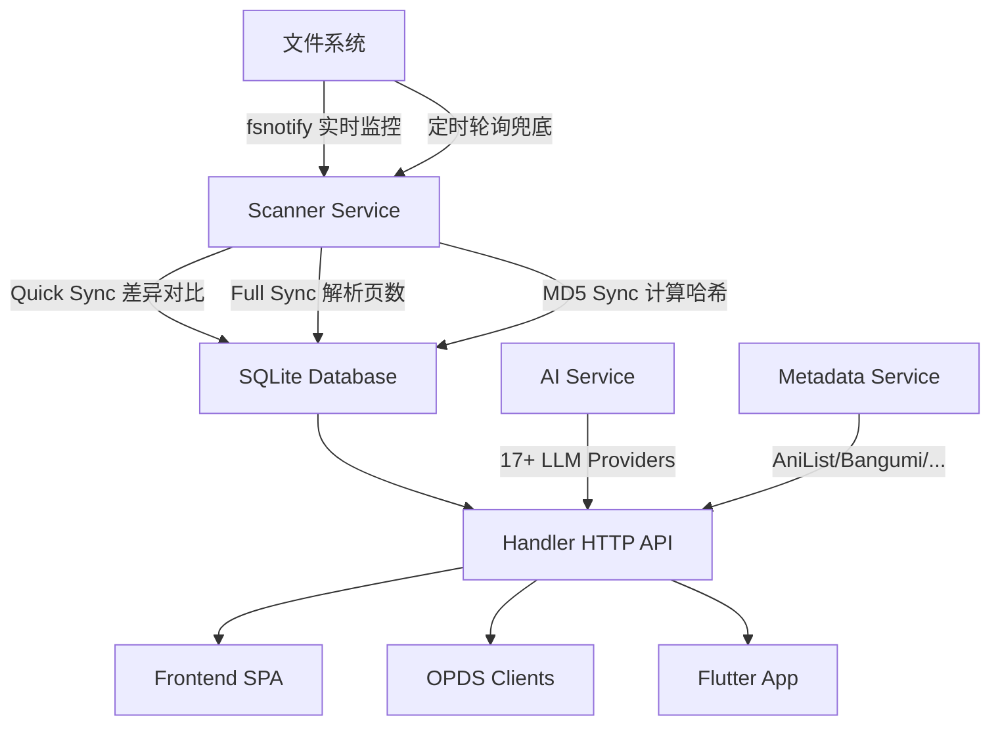

# NowenReader

<p align="center">
  
  
  
  
  
  
</p>

<p align="center">
  <strong>高性能自托管漫画 & 小说管理阅读平台</strong><br>
  Go 单二进制构建 · 轻量极速 · AI 智能辅助 · NAS 友好
</p>

<p align="center">
  <a href="#-为什么选择-nowenreader">为什么选择</a> •
  <a href="#-核心特性">核心特性</a> •
  <a href="#-快速开始">快速开始</a> •
  <a href="#-部署指南">部署指南</a> •
  <a href="#️-配置说明">配置</a> •
  <a href="#-api-文档">API</a> •
  <a href="#️-开发指南">开发</a> •
  <a href="#-常见问题">FAQ</a> •
  <a href="#-参与贡献">贡献</a>
</p>

---

<!-- 
## 📸 界面预览

> TODO: 在此添加项目截图，建议包含：首页列表、漫画阅读器、小说阅读器、AI 功能、统计页面、移动端界面

| 首页书库 | 漫画阅读器 | 小说阅读器 |
|:---:|:---:|:---:|
|  |  |  |

| AI 智能辅助 | 阅读统计 | 移动端 |
|:---:|:---:|:---:|
|  |  |  |

--- 
-->

## 💡 为什么选择 NowenReader？

市面上的漫画/小说管理工具往往存在各种痛点：内存占用动辄 1 GB+、部署复杂依赖多、中文支持缺失、功能单一……

NowenReader 专为解决这些问题而生，尤其针对 **NAS 用户**和**个人服务器**场景深度优化：

| 🏆 核心优势 | 说明 |
|:---|:---|
| 💾 **极致轻量** | 内存限制 512 MB 即可流畅运行，实际日常占用更低；Docker 镜像仅约 30 MB |
| 📦 **零依赖部署** | Go 编译为单个静态二进制，前端通过 `go:embed` 嵌入其中，一个文件即可运行 |
| 🐳 **Docker 一键启动** | 提供通用、生产、NAS 三种 Compose 配置，5 分钟完成部署 |
| 🤖 **AI 智能辅助** | 可选接入 17+ LLM 供应商（含主流国内大模型），提供智能标签、语义搜索、个性化推荐等能力 |
| 📚 **全格式覆盖** | 漫画（ZIP / CBZ / CBR / RAR / 7Z / CB7 / PDF）+ 小说（TXT / EPUB / MOBI / AZW3 / HTML） |
| 🌐 **中文原生支持** | 中英双语界面、元数据中英翻译、中文标签自动翻译 |
| 📱 **多端访问** | Web PWA + Flutter 原生客户端（Android / iOS / 桌面），随时随地阅读 |
| 🏗️ **多平台架构** | 支持 amd64 / arm64，覆盖主流 NAS（群晖、威联通、绿联、铁威马等）及 ARM 开发板 |

---

## ✨ 核心特性

### 📚 内容管理

- **多格式支持** — 漫画：ZIP / CBZ / CBR / RAR / 7Z / CB7 / PDF；小说：TXT / EPUB / MOBI / AZW3 / HTML
- **自动扫描入库** — fsnotify 实时监控 + 定时轮询双保障，新增/删除文件自动同步
- **标签 & 分类** — 多标签、多分类管理，标签颜色自定义
- **合并分组** — 系列卷册自动检测 & 手动归组，支持批量创建
- **收藏 & 评分** — 一键收藏、1-5 星评分
- **阅读状态** — 未读 / 在读 / 已读 / 搁置，首页「继续阅读」快速恢复
- **元数据编辑** — 在线编辑标题、作者、出版社、年份、描述等
- **文件上传** — 直接通过 Web UI 上传漫画/小说文件
- **批量操作** — 批量打标签、分类、删除、翻译、获取元数据
- **重复检测** — 多维度检测（文件哈希、大小、标题相似度），一键去重
- **无效清理** — 一键清理文件已不存在的失效条目

### 🔍 元数据 & 智能抓取

- **五大数据源** — AniList / Bangumi / MangaDex / MangaUpdates / Kitsu
- **ComicInfo.xml** — 自动读取漫画内嵌元数据
- **小说元数据** — 自动提取 EPUB / TXT 小说元数据
- **标签翻译** — 中英文标签自动翻译（AI 驱动）
- **元数据翻译** — 批量翻译漫画标题、简介、类型

### 🤖 AI 智能辅助（可选）

> AI 功能完全可选，不配置也不影响任何核心功能的使用。

支持接入 **17+ LLM 供应商**，包括 OpenAI / Anthropic / Google Gemini / 通义千问 / DeepSeek / 智谱 GLM / 百川 / Kimi / MiniMax / 讯飞星火 等。

| 功能 | 说明 |
|:---|:---|
| 🔎 语义搜索 | 自然语言搜索漫画，如「关于巨人的漫画」 |
| 📝 智能摘要 | 生成漫画/小说内容摘要 |
| 🏷️ 标签建议 | 基于内容 AI 推荐标签（支持批量） |
| 📂 分类建议 | AI 推荐合适的分类（支持批量） |
| 🖼️ 封面分析 | 分析封面内容，辅助分类 |
| 📖 文件名解析 | 从文件名中智能提取元数据 |
| 📊 阅读洞察 | 基于阅读统计生成个性化阅读报告 |
| 💬 AI 对话 | 阅读器内置 AI 聊天，讨论当前阅读内容 |
| 📑 章节摘要 | 生成小说章节摘要（支持批量） |
| 📖 章节回顾 | 快速回顾之前章节的内容 |
| 🌐 页面翻译 | 漫画页面 OCR + 翻译 |
| 📋 完善元数据 | AI 补全缺失的元数据字段 |
| 🔗 分组检测 | AI 增强的系列/卷册自动分组检测 |
| ✅ 重复验证 | AI 验证重复检测结果的准确性 |
| 🎯 推荐理由 | AI 生成个性化推荐理由 |
| 📅 目标建议 | 基于阅读习惯推荐合理阅读目标 |
| 🔧 提示词模板 | 可自定义 AI 提示词模板 |
| 📊 用量统计 | AI 调用次数、Token 消耗、耗时统计 |

### 📖 阅读体验

- **漫画阅读器** — 单页 / 双页 / 条漫 / Webtoon 多种阅读模式
- **小说阅读器** — EPUB 章节渲染、TXT 智能分章阅读
- **PDF 阅读器** — 基于 PDF.js 原生渲染，微信浏览器自动降级为后端图片渲染
- **继续阅读** — 首页快速恢复上次阅读位置
- **阅读统计** — 阅读时间、会话记录、每日趋势、增强统计、年度报告
- **文件统计** — 各格式文件数量、存储空间占用分析
- **阅读目标** — 设定每日/每周阅读目标，追踪达成进度
- **数据导出** — JSON 全量导出、CSV 会话/漫画导出
- **阅读器设置** — 适应模式、阅读方向（LTR/RTL）、自动翻页、预加载、无限滚动
- **默认阅读模式** — 设置页预选默认模式，无需每次手动切换

### 📡 协议 & 集成

- **OPDS 协议** — 支持 KOReader / Moon+ Reader 等阅读器远程串流

### 📱 多端支持

- **PWA** — 手机浏览器「添加到主屏幕」，体验接近原生 App
- **Flutter 原生客户端** — 提供 Android / iOS 原生应用（详见 [`flutter_app/`](flutter_app/)）
  - Material 3 设计 · 手势缩放 · 沉浸式阅读 · 阅读进度同步 · 深浅主题 · 阅读统计

### 🛠️ 部署 & 架构

- **Go 单二进制** — 无需 Node.js / npm，前端编译进二进制，一个文件部署
- **多用户认证** — 管理员 / 普通用户角色，Cookie Session 认证
- **SQLite 零配置** — WAL 模式高性能，自动 Schema 迁移，FTS5 全文搜索
- **Docker 多平台** — amd64 / arm64 双架构镜像，~30MB 极小体积
- **多语言** — 中文 / English 国际化
- **主题** — 深色 / 浅色 / 跟随系统
- **响应式** — 桌面端 + 移动端自适应布局
- **安全中间件** — CORS / Auth / Gzip / Rate Limit / Security Headers / Request Timeout

---

## 🚀 快速开始

三步完成最小化部署：

```bash
# 1. 下载生产配置
curl -O https://raw.githubusercontent.com/cropflre/nowen-reader/main/docker-compose.prod.yml

# 2. 一键启动
docker compose -f docker-compose.prod.yml up -d

# 3. 打开浏览器访问
# http://localhost:6680
```

首次访问会引导注册管理员账号。将漫画放入 `./comics/`、小说放入 `./novels/` 目录即可自动扫描入库。

---

## 📦 部署指南

提供 5 种部署方式，选择最适合你的场景：

### 方式 1：Docker Hub 镜像（推荐）

> 适用于大多数用户，开箱即用。

```bash
# 下载配置文件
curl -O https://raw.githubusercontent.com/cropflre/nowen-reader/main/docker-compose.prod.yml

# 启动
docker compose -f docker-compose.prod.yml up -d

# 访问 http://localhost:6680
```

**更新版本：**

```bash
docker compose -f docker-compose.prod.yml pull
docker compose -f docker-compose.prod.yml up -d
```

### 方式 2：NAS 部署（群晖 / 威联通 / 绿联 / 铁威马）

> 专为 NAS 环境优化，内存限制 512 MB，轻量可靠。

```bash
# 下载 NAS 专用配置
curl -O https://raw.githubusercontent.com/cropflre/nowen-reader/main/docker-compose.nas.yml

# 编辑配置，修改路径为 NAS 上的实际路径
vi docker-compose.nas.yml

# 启动
docker compose -f docker-compose.nas.yml up -d
```

NAS 配置文件默认路径示例（以群晖为例）：

| 容器路径 | 宿主机路径示例 | 说明 |
|:---|:---|:---|
| `/data` | `/volume1/docker/nowen-reader/data` | 数据库（重要，勿删） |
| `/app/.cache` | `/volume1/docker/nowen-reader/cache` | 缩略图与页面缓存 |
| `/app/comics` | `/volume1/comics` | 漫画主目录 |
| `/app/novels` | `/volume1/novels` | 电子书主目录（可选） |

> 💡 **多目录挂载**：如果漫画/小说分散在多个文件夹，将它们全部挂载进容器（如 `/mnt/manga`、`/mnt/novels2`），然后在 Web 界面 **设置 → 额外漫画目录 / 额外电子书目录** 中添加对应路径即可。
>
> 🔑 **权限问题**：NAS 上如遇到 `permission denied`，可在 compose 的 `environment` 中取消注释并设置 `PUID` / `PGID` 为宿主机文件的实际 UID/GID（通过 `ls -ln` 查看）。

### 方式 3：源码构建 Docker

```bash
git clone https://github.com/cropflre/nowen-reader.git
cd nowen-reader

# 一键构建并启动
docker compose up -d

# 访问 http://localhost:6680
```

### 方式 4：从源码编译二进制

> 适用于不使用 Docker 的环境，或需要定制化构建的开发者。

```bash
# 前置条件: Go 1.23+, Node.js 20+（可选，仅构建前端需要）

git clone https://github.com/cropflre/nowen-reader.git
cd nowen-reader

# 仅构建后端（API-only 模式，不含前端）
make build

# 构建含前端的完整版本（推荐）
make build-full

# 运行
./nowen-reader
```

### 方式 5：预编译二进制

从 [GitHub Releases](https://github.com/cropflre/nowen-reader/releases) 下载对应平台的二进制文件，无需编译直接运行：

| 平台 | 文件名 |
|:---|:---|
| Linux x86_64 | `nowen-reader-linux-amd64` |
| Linux ARM64 | `nowen-reader-linux-arm64` |
| macOS x86_64 | `nowen-reader-darwin-amd64` |
| macOS ARM64 (Apple Silicon) | `nowen-reader-darwin-arm64` |
| Windows x86_64 | `nowen-reader-windows-amd64.exe` |

```bash
# Linux / macOS
chmod +x nowen-reader-linux-amd64
./nowen-reader-linux-amd64

# Windows
nowen-reader-windows-amd64.exe
```

---

## ⚙️ 配置说明

### 环境变量

| 变量 | 默认值 | 说明 |
|:---|:---|:---|
| `PORT` | `3000` | HTTP 服务监听端口 |
| `DATABASE_URL` | `./data/nowen-reader.db` | SQLite 数据库文件路径 |
| `COMICS_DIR` | `./comics` | 漫画主目录 |
| `NOVELS_DIR` | `./novels` | 电子书主目录 |
| `DATA_DIR` | `./.cache` | 数据/缓存目录（缩略图、页面缓存、`site-config.json`、`ai-config.json`） |
| `FRONTEND_DIR` | — | 开发模式下指向独立前端构建产物；生产环境留空以使用嵌入前端 |
| `GIN_MODE` | `debug` | Gin 运行模式（`debug` 详细日志 / `release` 静默） |
| `TZ` | `Asia/Shanghai` | 时区 |
| `PUID` / `PGID` | `1001` / `1001` | Docker 内进程的 UID / GID（用于解决 bind-mount 权限问题） |

### 站点设置

可通过 Web UI 的 **设置** 面板修改，或直接编辑 `{DATA_DIR}/site-config.json`：

```json
{
  "siteName": "NowenReader",
  "comicsDir": "/app/comics",
  "extraComicsDirs": ["/mnt/manga", "/mnt/comics2"],
  "novelsDir": "/app/novels",
  "extraNovelsDirs": ["/mnt/novels2"],
  "thumbnailWidth": 400,
  "thumbnailHeight": 560,
  "pageSize": 24,
  "language": "zh-CN",
  "theme": "dark",
  "registrationMode": "open",
  "scannerConfig": {
    "syncCooldownSec": 30,
    "fsDebounceMs": 2000,
    "fullSyncBatchSize": 50,
    "quickSyncIntervalSec": 60,
    "fullSyncIntervalSec": 120,
    "md5Workers": 2
  }
}
```

<details>
<summary>📋 扫描器参数详解</summary>

| 参数 | 默认值 | 说明 |
|:---|:---|:---|
| `syncCooldownSec` | 30 | 两次同步之间的最小冷却时间（秒） |
| `fsDebounceMs` | 2000 | 文件变更后延迟触发同步的防抖时间（毫秒） |
| `fullSyncBatchSize` | 50 | 完整同步每批处理的漫画数量 |
| `quickSyncIntervalSec` | 60 | 快速同步轮询间隔（秒），作为 fsnotify 兜底 |
| `fullSyncIntervalSec` | 120 | 完整同步间隔（秒），处理页数统计与 MD5 计算 |
| `md5Workers` | 2 | MD5 计算的并发数；网盘挂载场景建议设为 1–2 |

</details>

<details>
<summary>🔐 注册模式（registrationMode）</summary>

| 取值 | 说明 |
|:---|:---|
| `open` | 开放注册（默认），任何人可自行注册 |
| `invite` | 仅限邀请，管理员生成邀请码后方可注册 |
| `closed` | 关闭注册，仅管理员可创建账号 |

</details>

### AI 配置

通过 Web UI 的 **设置 → AI 面板** 配置，或编辑 `{DATA_DIR}/ai-config.json`。

**国际供应商**：OpenAI / Anthropic / Google Gemini / Groq / Mistral / Cohere / Together AI / Perplexity / Fireworks 等

**国内供应商**：通义千问 / DeepSeek / 智谱 GLM / 百川 / 月之暗面 Kimi / 零一万物 / MiniMax / 讯飞星火 等

### 支持的文件格式

| 类型 | 格式 |
|:---|:---|
| 漫画 / 压缩包 | `.zip` `.cbz` `.cbr` `.rar` `.7z` `.cb7` `.pdf` |
| 小说 / 电子书 | `.txt` `.epub` `.mobi` `.azw3` `.html` `.htm` |
| 图片（压缩包内） | `.jpg` `.jpeg` `.png` `.gif` `.webp` `.bmp` `.avif` |

### 外部依赖（Docker 已内置）

| 工具 | 用途 | 是否必须 |
|:---|:---|:---|
| `p7zip` | 解压 .7z / .cb7 文件 | 可选 |
| `mupdf-tools` (mutool) | PDF 页面渲染 | 可选 |
| `libwebp-tools` (cwebp) | WebP 缩略图生成 | 可选（降级为 JPEG） |

> Docker 镜像已内置所有依赖，手动安装二进制时按需安装即可。

---

## 🏗️ 架构概览

```
┌─────────────────────────────────────────────────────────┐
│                  NowenReader Architecture                │
├──────────────────────┬──────────────────────────────────┤
│   Frontend (SPA)     │   Backend (Go)                   │
│                      │                                  │
│  React 19            │  Gin Web Framework               │
│  Vite 6              │  ┌─────────────────────────┐     │
│  Tailwind CSS v4     │  │ Handler (HTTP API)       │     │
│  React Router v7     │  ├─────────────────────────┤     │
│  lucide-react        │  │ Middleware               │     │
│  PDF.js              │  │ (CORS/Auth/Gzip/Rate     │     │
│                      │  │  Limit/Security/Timeout) │     │
│  ┌──────────────┐    │  ├─────────────────────────┤     │
│  │ Pages        │    │  │ Service                  │     │
│  │ Components   │    │  │ (AI/Scanner/Metadata/    │     │
│  │ Hooks        │    │  │  Recommend/OPDS/Tag)     │     │
│  │ i18n         │    │  ├─────────────────────────┤     │
│  │ Theme        │    │  │ Store (SQLite + FTS5)    │     │
│  │ Auth Context │    │  ├─────────────────────────┤     │
│  └──────────────┘    │  │ Archive                  │     │
│                      │  │ (ZIP/RAR/7Z/PDF/EPUB/TXT)│     │
│  go:embed ──────────►│  └─────────────────────────┘     │
│  编译进二进制         │                                  │
├──────────────────────┼──────────────────────────────────┤
│   Flutter App        │                                  │
│  (Android / iOS)     │      ← HTTP API →                │
│  Riverpod + GoRouter │                                  │
└──────────────────────┴──────────────────────────────────┘
                              │
                    ┌─────────┴─────────┐
                    │   SQLite (WAL)    │
                    │   FTS5 全文索引    │
                    └───────────────────┘
```

### 核心数据流



---

## 📁 项目结构

```
nowen-reader/
├── cmd/
│   ├── server/              # 主服务入口 — 启动 HTTP / DB / Scanner
│   └── migrate/             # 数据库迁移 CLI（Prisma → SQLite）
├── internal/
│   ├── archive/             # 压缩包 & 电子书解析（ZIP/RAR/7Z/PDF/EPUB/TXT/HTML）
│   ├── config/              # 配置管理（SiteConfig JSON + 环境变量）
│   ├── handler/             # HTTP API Handler（40+ 文件，按领域拆分）
│   ├── middleware/          # 中间件（Auth / CORS / Gzip / RateLimit / Security / Timeout）
│   ├── model/               # 数据模型（User / Comic / Tag / Category / ReadingSession / ComicGroup 等）
│   ├── service/             # 业务逻辑层（AI / Scanner / Metadata / Recommend / OPDS / Tag）
│   └── store/               # 数据库层（SQLite CRUD / Query / Batch / Stats / Migration）
├── web/
│   ├── embed.go             # go:embed 前端嵌入入口
│   └── dist/                # 前端构建产物（编译时填充）
├── frontend/                # Vite + React 19 + TypeScript 前端
│   └── src/
│       ├── app/             # 页面路由（首页 / comic / novel / reader / scraper /
│       │                    #   settings / stats / recommendations / collections /
│       │                    #   tag-manager / group / logs 等）
│       ├── components/      # UI 组件（60+，含阅读器、AI 面板、批量操作等）
│       ├── hooks/           # 自定义 Hooks
│       ├── api/ & lib/      # API 客户端 / i18n / Theme / Auth Context / PWA
│       └── types/           # 共享 TypeScript 类型
├── flutter_app/             # Flutter 原生客户端
│   └── lib/
│       ├── app/             # App / Router / Theme
│       ├── data/            # API 客户端、数据模型、Riverpod Provider
│       └── features/        # 功能模块（auth / home / detail / reader / search /
│                            #   stats / settings / server / groups / favorites /
│                            #   tag_manager / metadata / shell）
├── docker-compose.yml       # 一键部署（源码构建）
├── docker-compose.prod.yml  # 生产部署（Docker Hub 镜像）
├── docker-compose.nas.yml   # NAS 部署（群晖 / 威联通 / 绿联 / 铁威马）
├── Dockerfile               # 多阶段构建（Node 20 → Go 1.23 → Alpine 3.20，约 30 MB）
├── Makefile                 # 构建自动化（30+ 目标）
└── go.mod                   # Go 模块（Go 1.23）
```

---

## 📡 API 文档

NowenReader 提供完整的 RESTful API，所有功能均可通过 API 调用。

> 🔒 = 需要认证 &emsp; 🔒管理员 = 需要管理员权限

<details>
<summary><strong>🔐 认证</strong></summary>

| 方法 | 路径 | 说明 |
|:---|:---|:---|
| POST | `/api/auth/register` | 注册（限流） |
| POST | `/api/auth/login` | 登录（限流） |
| POST | `/api/auth/logout` | 登出 |
| GET | `/api/auth/me` | 当前用户信息 |
| GET | `/api/auth/users` | 用户列表 🔒管理员 |
| PUT | `/api/auth/users` | 更新用户 🔒管理员 |
| DELETE | `/api/auth/users` | 删除用户 🔒管理员 |

</details>

<details>
<summary><strong>📚 漫画</strong></summary>

| 方法 | 路径 | 说明 |
|:---|:---|:---|
| GET | `/api/comics` | 列表（搜索/筛选/分页/排序/FTS5 全文搜索） |
| GET | `/api/comics/:id` | 详情 |
| PUT | `/api/comics/:id/favorite` | 切换收藏 🔒 |
| PUT | `/api/comics/:id/rating` | 更新评分 🔒 |
| PUT | `/api/comics/:id/progress` | 更新阅读进度 🔒 |
| PUT | `/api/comics/:id/reading-status` | 设置阅读状态 🔒 |
| PUT | `/api/comics/:id/metadata` | 编辑元数据 🔒 |
| DELETE | `/api/comics/:id/delete` | 删除漫画（含磁盘文件） 🔒 |
| POST | `/api/comics/batch` | 批量操作 🔒 |
| POST | `/api/comics/cleanup` | 清理无效条目 🔒 |
| PUT | `/api/comics/reorder` | 自定义排序 🔒 |
| GET | `/api/comics/duplicates` | 重复检测 |

</details>

<details>
<summary><strong>🏷️ 标签 & 分类</strong></summary>

| 方法 | 路径 | 说明 |
|:---|:---|:---|
| GET | `/api/tags` | 标签列表 |
| PUT | `/api/tags/color` | 更新标签颜色 |
| POST | `/api/tags/translate` | 标签翻译 |
| POST | `/api/comics/:id/tags` | 添加标签 🔒 |
| DELETE | `/api/comics/:id/tags` | 移除标签 🔒 |
| POST | `/api/comics/:id/translate-metadata` | 翻译漫画元数据 🔒 |
| GET | `/api/categories` | 分类列表 |
| POST | `/api/categories` | 初始化分类 |
| POST | `/api/comics/:id/categories` | 添加分类 🔒 |
| PUT | `/api/comics/:id/categories` | 设置分类 🔒 |
| DELETE | `/api/comics/:id/categories` | 移除分类 🔒 |

</details>

<details>
<summary><strong>📁 合并分组</strong></summary>

| 方法 | 路径 | 说明 |
|:---|:---|:---|
| GET | `/api/groups` | 分组列表 |
| GET | `/api/groups/comic-map` | 漫画-分组映射关系 |
| GET | `/api/groups/:id` | 分组详情 |
| POST | `/api/groups` | 创建分组 🔒 |
| PUT | `/api/groups/:id` | 更新分组 🔒 |
| DELETE | `/api/groups/:id` | 删除分组 🔒 |
| POST | `/api/groups/:id/comics` | 添加漫画到分组 🔒 |
| DELETE | `/api/groups/:id/comics/:comicId` | 从分组移除漫画 🔒 |
| PUT | `/api/groups/:id/reorder` | 分组内漫画排序 🔒 |
| POST | `/api/groups/auto-detect` | 自动检测可合并分组 🔒 |
| POST | `/api/groups/batch-create` | 批量创建分组 🔒 |

</details>

<details>
<summary><strong>🖼️ 图片 & 内容</strong></summary>

| 方法 | 路径 | 说明 |
|:---|:---|:---|
| GET | `/api/comics/:id/pages` | 页面列表 |
| GET | `/api/comics/:id/page/:pageIndex` | 页面图片 |
| GET | `/api/comics/:id/thumbnail` | 缩略图 |
| POST | `/api/comics/:id/cover` | 更新封面 🔒 |
| GET | `/api/comics/:id/pdf` | PDF 文件流式传输 |
| GET | `/api/comics/:id/chapter/:chapterIndex` | 小说章节内容 |
| GET | `/api/comics/:id/epub-resource/*resourcePath` | EPUB 资源 |
| POST | `/api/thumbnails/manage` | 缩略图管理 🔒 |

</details>

<details>
<summary><strong>🌐 元数据</strong></summary>

| 方法 | 路径 | 说明 |
|:---|:---|:---|
| GET/POST | `/api/metadata/search` | 搜索元数据 |
| POST | `/api/metadata/apply` | 应用元数据 |
| POST | `/api/metadata/scan` | 扫描 ComicInfo.xml |
| POST | `/api/metadata/novel-scan` | 扫描小说元数据 |
| POST | `/api/metadata/batch` | 批量获取元数据 |
| POST | `/api/metadata/translate-batch` | 批量翻译元数据 |

</details>

<details>
<summary><strong>🤖 AI</strong></summary>

| 方法 | 路径 | 说明 |
|:---|:---|:---|
| GET | `/api/ai/status` | AI 服务状态 |
| GET/PUT | `/api/ai/settings` | AI 设置 |
| GET | `/api/ai/models` | 可用模型列表 |
| POST | `/api/ai/test` | 测试 AI 连接 |
| GET/DELETE | `/api/ai/usage` | AI 用量统计 |
| GET/PUT/DELETE | `/api/ai/prompts` | 提示词模板 |
| POST | `/api/ai/chat` | AI 对话 |
| POST | `/api/ai/semantic-search` | 语义搜索 |
| POST | `/api/ai/reading-insight` | 阅读洞察报告 |
| POST | `/api/ai/batch-suggest-tags` | 批量标签建议 |
| POST | `/api/ai/suggest-category` | 分类建议 |
| POST | `/api/ai/batch-suggest-category` | 批量分类建议 |
| POST | `/api/ai/enhance-group-detect` | AI 增强分组检测 |
| POST | `/api/ai/verify-duplicates` | AI 重复验证 |
| POST | `/api/ai/recommend-goal` | AI 推荐阅读目标 |

**AI 漫画级功能：**

| 方法 | 路径 | 说明 |
|:---|:---|:---|
| POST | `/api/comics/:id/ai-summary` | 生成摘要 🔒 |
| POST | `/api/comics/:id/ai-parse-filename` | 解析文件名 🔒 |
| POST | `/api/comics/:id/ai-suggest-tags` | 标签建议 🔒 |
| POST | `/api/comics/:id/ai-analyze-cover` | 封面分析 🔒 |
| POST | `/api/comics/:id/ai-complete-metadata` | 完善元数据 🔒 |
| POST | `/api/comics/:id/ai-chapter-recap` | 章节回顾 🔒 |
| POST | `/api/comics/:id/ai-chapter-summary` | 章节摘要 🔒 |
| POST | `/api/comics/:id/ai-chapter-summaries` | 批量章节摘要 🔒 |
| POST | `/api/comics/:id/ai-translate-page` | 页面翻译 🔒 |

</details>

<details>
<summary><strong>📊 阅读统计 & 目标 & 导出</strong></summary>

| 方法 | 路径 | 说明 |
|:---|:---|:---|
| GET | `/api/stats` | 阅读统计 |
| GET | `/api/stats/yearly` | 年度阅读报告 |
| POST | `/api/stats/session` | 开始阅读会话 |
| PUT | `/api/stats/session` | 结束阅读会话 |
| POST | `/api/stats/session/end` | 结束会话（sendBeacon 兜底） |
| GET | `/api/stats/enhanced` | 增强统计数据 |
| GET | `/api/stats/files` | 文件统计 |
| GET | `/api/goals` | 获取目标进度 |
| POST | `/api/goals` | 设定阅读目标 🔒 |
| DELETE | `/api/goals` | 删除阅读目标 🔒 |
| GET | `/api/export/json` | JSON 全量导出 |
| GET | `/api/export/csv/sessions` | CSV 会话导出 |
| GET | `/api/export/csv/comics` | CSV 漫画列表导出 |

</details>

<details>
<summary><strong>📡 OPDS & 推荐 & 其他</strong></summary>

| 方法 | 路径 | 说明 |
|:---|:---|:---|
| GET | `/api/opds` | OPDS 根目录 |
| GET | `/api/opds/all` | 全部漫画 |
| GET | `/api/opds/recent` | 最近更新 |
| GET | `/api/opds/favorites` | 收藏列表 |
| GET | `/api/opds/search` | OPDS 搜索 |
| GET | `/api/opds/download/:id` | 下载原始文件 |
| GET | `/api/recommendations` | 个性化推荐 |
| GET | `/api/recommendations/similar/:id` | 相似推荐 |
| POST | `/api/recommendations/ai-reasons` | AI 推荐理由 |
| GET | `/api/health` | 健康检查 |
| GET/PUT | `/api/site-settings` | 站点设置 |
| POST | `/api/upload` | 文件上传 🔒 |
| POST | `/api/cache` | 缓存管理 🔒 |
| POST | `/api/sync` | 触发文件同步 🔒 |
| GET | `/api/browse-dirs` | 浏览服务器目录 🔒 |
| GET | `/api/logs` | 错误日志 🔒管理员 |
| GET | `/api/logs/stats` | 日志统计 🔒管理员 |
| GET | `/api/logs/export` | 导出日志 🔒管理员 |
| DELETE | `/api/logs` | 清理日志 🔒管理员 |

</details>

---

## 🛠️ 开发指南

### 前置条件

- **Go 1.23+** — 后端开发
- **Node.js 20+** — 前端开发
- **Flutter 3.2+ / Dart 3.2+** — 移动端开发（可选）

### 快速上手

```bash
# 安装 Go 依赖
go mod download

# 后端开发模式（直接运行，无需编译前端）
make dev

# 前端开发模式（另一个终端）
cd frontend && npm install && npm run dev

# 或：后端 + 指定前端构建产物目录
make dev-with-frontend
```

### 前端开发

Vite 开发服务器自动代理 API 请求到后端（`localhost:3000`）：

```bash
cd frontend
npm install
npm run dev      # 启动 http://localhost:5173
npm run build    # 类型检查 + 构建到 frontend/dist/
npm run preview  # 本地预览生产构建
```

### Flutter 客户端开发

```bash
cd flutter_app
flutter pub get
flutter run                     # 运行到模拟器/真机
flutter build apk --release     # 构建 Android APK
flutter build appbundle --release  # 构建 Google Play 上架用 AAB
```

> 详细说明参见 [`flutter_app/README.md`](flutter_app/README.md)。

### Makefile 常用命令

| 命令 | 说明 |
|:---|:---|
| `make build` | 构建当前平台二进制 |
| `make build-full` | 构建前端 + 后端完整版本 |
| `make build-all` | 构建所有平台（Linux amd64/arm64 + 当前平台） |
| `make dev` | 开发模式运行 |
| `make test` | 运行所有测试（含 race 检测） |
| `make test-cover` | 测试 + 覆盖率报告 |
| `make docker` | 构建 Docker 镜像 |
| `make docker-multiarch` | 构建多平台镜像（amd64 + arm64） |
| `make frontend` | 构建前端到 web/dist/ |
| `make lint` | golangci-lint 检查 |
| `make clean` | 清理构建产物 |

<details>
<summary>查看全部 Makefile 目标</summary>

| 命令 | 说明 |
|:---|:---|
| `make build-linux` | 构建 Linux amd64 二进制 |
| `make build-arm64` | 构建 Linux arm64 二进制 |
| `make build-static` | 静态编译（CGO_ENABLED=0） |
| `make dev-with-frontend` | 开发模式（含前端目录） |
| `make test-short` | 运行短测试 |
| `make vet` | Go vet 检查 |
| `make fmt` | 代码格式化 |
| `make docker-push` | 推送 Docker 镜像 |
| `make docker-up` | docker compose up |
| `make docker-down` | docker compose down |
| `make docker-logs` | 查看容器日志 |
| `make migrate` | 构建迁移工具 |
| `make version` | 显示版本信息 |
| `make info` | 显示完整构建信息 |

</details>

### CI/CD

项目使用 GitHub Actions 实现自动化：

- **`build.yml`** — 代码推送/PR 触发测试；Tag 推送触发多平台二进制构建 + Docker 多架构推送 + GitHub Release
- **`deploy.yml`** — main 分支推送触发 Docker 构建推送 + SSH 自动部署；Tag 推送触发多平台构建和 Release

### 数据库迁移

SQLite 使用版本化的自动迁移系统，**启动时自动执行，无需手动操作**。迁移版本记录在 `_migrations` 表中。

---

## 🏗️ 技术栈

### 后端

| 组件 | 技术 |
|:---|:---|
| 语言 | Go 1.23 |
| Web 框架 | Gin v1.10 |
| 数据库 | SQLite（`modernc.org/sqlite`，纯 Go 实现，零 CGO） |
| 全文搜索 | SQLite FTS5 |
| 密码加密 | bcrypt（`golang.org/x/crypto`） |
| 压缩包解析 | `archive/zip` + `rardecode/v2` + 外部 CLI（`7z`） |
| PDF 渲染 | `mupdf-tools`（`mutool draw`） |
| 图片处理 | 纯 Go `image` 库 + `libwebp-tools`（`cwebp`） |
| 文件监听 | `fsnotify`（实时）+ 定时轮询（兜底） |
| 认证方式 | Cookie Session（bcrypt + UUID Token） |
| 前端嵌入 | `go:embed` |

### 前端

| 组件 | 技术 |
|:---|:---|
| 框架 | React 19 |
| 构建工具 | Vite 6 |
| 路由 | React Router v7（`react-router-dom`） |
| 样式 | Tailwind CSS v4（通过 `@tailwindcss/vite`） |
| 图标 | `lucide-react` |
| PDF | `pdfjs-dist` v5 |
| 语言 | TypeScript 5 |
| 国际化 | 自研 i18n（中文 / English） |
| 主题 | Context API（dark / light / system） |

### 移动端

| 组件 | 技术 |
|:---|:---|
| 框架 | Flutter 3.x（Dart SDK ≥ 3.2） |
| 状态管理 | Riverpod 2.x |
| 路由 | GoRouter 14.x |
| HTTP 客户端 | Dio 5.x + `dio_cookie_manager` |
| 图片 | `cached_network_image` + `photo_view` |
| 设计 | Material 3 |

### 部署 & 运维

| 组件 | 技术 |
|:---|:---|
| 容器化 | Docker 多阶段构建（Node 20 / Go 1.23 / Alpine 3.20，约 30 MB） |
| 多平台 | amd64 + arm64（Docker Buildx） |
| CI/CD | GitHub Actions（测试 / 构建 / Docker / Release / SSH 部署） |
| PWA | Service Worker + `manifest.json` |
| 进程管理 | `tini`（PID 1 信号处理） |
| 权限管理 | `su-exec`（root → `appuser` 降权） |

---

## ❓ 常见问题

<details>
<summary><strong>Docker 启动后无法访问</strong></summary>

1. 确认端口映射正确（默认 `6680:3000`）
2. 检查防火墙是否放行 6680 端口
3. 如果使用 NAS，确认 Docker 服务已正确启动
4. 查看日志排查错误：`docker compose logs -f`

</details>

<details>
<summary><strong>SQLite "out of memory" 错误</strong></summary>

通常是**目录权限问题**，而非内存不足。Docker 环境下 `docker-entrypoint.sh` 会自动修复权限。手动运行时请确保 `data/` 目录对当前用户可写。

</details>

<details>
<summary><strong>如何添加漫画/小说？</strong></summary>

三种方式：
1. **文件目录** — 将文件放入 `comics/` 目录，系统自动扫描入库
2. **Web 上传** — 通过 Web UI 上传按钮直接上传文件
3. **额外目录** — 在 **设置 → 额外漫画目录** 中添加更多路径（Docker 需先挂载对应目录）

</details>

<details>
<summary><strong>缩略图不显示</strong></summary>

确保安装了 `libwebp-tools`（cwebp 命令）。Docker 镜像已内置。如仍不显示，在 **设置** 中手动触发缩略图批量生成。

</details>

<details>
<summary><strong>PDF 无法渲染</strong></summary>

PDF 渲染需要 `mupdf-tools`（mutool 命令）。Docker 镜像已内置。手动安装二进制时需自行安装该工具。

</details>

<details>
<summary><strong>如何配置 AI？</strong></summary>

进入 **设置 → AI 面板**，选择供应商、填入 API Key、选择模型，点击「测试连接」验证后保存即可。AI 功能完全可选，不配置不影响任何核心功能。

</details>

<details>
<summary><strong>如何使用 OPDS？</strong></summary>

使用支持 OPDS 的阅读器（如 KOReader、Moon+ Reader），添加 OPDS 目录地址：

```
http://你的IP:6680/api/opds
```

</details>

<details>
<summary><strong>多漫画目录怎么配置？</strong></summary>

1. Docker 环境：先在 `docker-compose.yml` 中挂载对应宿主机目录到容器内路径
2. 在 Web UI **设置 → 额外漫画目录** 中添加容器内的挂载路径
3. 系统会自动扫描所有配置的目录

</details>

<details>
<summary><strong>如何更新到最新版本？</strong></summary>

```bash
# Docker 部署
docker compose pull
docker compose up -d

# 二进制部署
# 下载最新 Release，替换二进制文件后重启即可
```

数据库升级自动完成，无需手动操作。

</details>

---

## 🤝 参与贡献

欢迎以任何形式参与贡献！

- 🐛 **提交 Bug** — [创建 Issue](https://github.com/cropflre/nowen-reader/issues)
- 💡 **功能建议** — [发起 Discussion](https://github.com/cropflre/nowen-reader/discussions)
- 🔧 **提交代码** — Fork → Branch → PR
- 🌐 **国际化翻译** — 添加新语言支持
- 📖 **完善文档** — 改进 README 或添加使用教程

### 开发流程

```bash
# 1. Fork 并克隆
git clone https://github.com/your-username/nowen-reader.git
cd nowen-reader

# 2. 创建功能分支
git checkout -b feature/your-feature

# 3. 开发 & 测试
make dev       # 启动开发服务器
make test      # 运行测试

# 4. 提交 & 推送
git commit -m "feat: your feature description"
git push origin feature/your-feature

# 5. 创建 Pull Request
```

---

## ⭐ Star History

如果这个项目对你有帮助，欢迎点一个 Star ⭐ 支持一下！

[](https://star-history.com/#cropflre/nowen-reader&Date)

---

## 📮 问题反馈

- 🐛 Bug / 功能建议：[GitHub Issues](https://github.com/cropflre/nowen-reader/issues) / [Discussions](https://github.com/cropflre/nowen-reader/discussions)
- 💬 QQ 交流群：**1093473044**

---

## 📄 License

[MIT](LICENSE) — 完全免费，随意使用。
